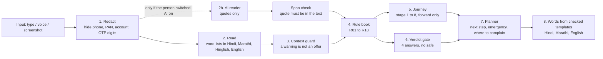

# How Satark is built

Satark follows an investment scam as it happens. This page explains how the pieces fit,
in plain words. The product plan is in [PRD.md](PRD.md).

## The big idea

> **Rules decide. AI only reads.**

Everything that decides "is this dangerous?" is a plain function that reads a versioned
rule book. An optional AI helper can *point at* words you wrote, but it can never decide
anything, and it can never say a message is fine.

## The pipeline

Each step is one small file in `engine/`:

| Step | File | What it does |
|---|---|---|
| 1 | `redact.ts` | Hides private numbers with a mask of the **same length**, so positions stay valid |
| 2 | `extract.ts`, `normalize.ts`, `rulebook/lexicon/*` | Finds phrases, links, UPI ids and registration numbers. Sees through fancy fonts, spaced letters, look-alike letters, hidden characters |
| 2b | `ai-facts.ts` | The span check for the optional AI helper |
| 3 | `guard.ts` | Ignores red-flag words inside a clear warning post, unless there is a live ask (a UPI id, a link, a payment request) |
| 4 | `rules.ts`, `rulebook.ts`, `rulebook/rules.json` | Turns facts into flags. R02 to R05 combine several clues |
| 5 | `journey.ts` | Works out the stage. It never moves backwards on its own |
| 6 | `verdict.ts` | STOP, HIGH RISK, CANNOT VERIFY, NO RED FLAGS FOUND. Never imports the AI |
| 7 | `planner.ts`, `links.ts` | The one thing to do now, Emergency Mode, and the right complaint route |
| 8 | `i18n/*` | Every sentence a person reads. The AI never writes these |

`engine/analyze.ts` runs the whole pipeline. It has no network calls, so the same code runs
in the browser, on the server and in the evaluation script. That means we test the real thing.

## Where things run

| On the person's phone | On our server |
|---|---|
| The whole engine, the case file (IndexedDB), voice in and out, QR reading | Optional AI helper (`/api/ai`), screenshot reader (`/api/ocr`), anonymous counts (`/api/radar`) |

The server never receives a message unless the person turned the AI helper on, and then it
only receives text with private numbers already hidden. The radar receives four small facts.

## Privacy, in code

- **Redact first.** Phone, Aadhaar, PAN, account, email and OTP digits are masked before
  any reader, and again on the server (`lib/server/gemini.ts`).
- **The case file stays on the device.** `lib/case-store.ts` uses IndexedDB.
- **The server keeps counts only.** `lib/server/radar-store.ts` has no text column. A test
  checks the column list. Groups smaller than five are hidden.
- **Screenshots are never stored.** `/api/ocr` reads the image once and forgets it.
- **No accounts, no tracking, no ads.**

## Adding a language

1. Copy `rulebook/lexicon/en.ts` to a new file and write the phrases in that language.
2. List it in `rulebook/lexicon/index.ts`.
3. Copy `i18n/en.ts` and translate it. The compiler tells you about any missing line.
4. Add it to `LANGS` in `i18n/index.ts`.

No model needs training. A native speaker must read the result before it is shown to anyone.

## Adding a rule

When SEBI or an exchange publishes a new advisory:

1. Add an entry to `rulebook/rules.json` with its severity, stage and source link.
2. Add its phrases to the word lists.
3. Add its wording to `i18n/*.ts`.
4. Add a test and re-run `npm run eval`.

## Technology

Next.js 16, React 19, TypeScript, Tailwind 4, Vitest. Zod checks everything that comes from
outside. SQLite is the one that ships inside Node (`node:sqlite`). The optional AI helper uses
`@google/genai` with the `gemini-flash-lite-latest` model. Docker runs everything on one port.
