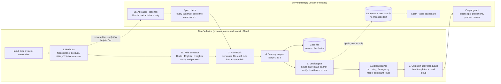

# SATARK: "Pause Before You Pay"
### Product Requirements Document (PRD), Final v2 — share with the whole team

**Hackathon:** SANGYAN — Investor Resilience Hackathon (SNTC, IIT BHU, with SEBI and NSDL)
**Track we are entering:** **Track A — Digital Fraud & Scam Resilience**
**What we must submit:** (1) Live demo link, (2) 3–5 minute video of one realistic user story, (3) PPT
**Rule for the whole team:** build ONE journey deeply. The organizers say depth on one real user journey beats many features.

---

## 0. Quick card (read this first)

| | |
|---|---|
| **Name** | Satark (means "alert") |
| **One line** | An app that follows an investment scam as it happens, tells the user which stage they are in, what the scammer will do next, and the one safe thing to do now |
| **User** | First-time investor from a small city, more at ease in Hindi or a regional language; also seniors and families who get "tips" and calls |
| **Core idea** | SEBI itself publishes the scam as a 7-stage poster. Satark turns that static poster into a **live, personal guide** |
| **Never does** | Say "safe", give stock tips, predict prices, name brokers, read SMS/OTPs, or store users' messages on a server |
| **Languages in demo** | English + Hindi + one regional language (Marathi by default), all human-checked. More languages = future scope |
| **Tech** | Next.js, TypeScript, rules engine that runs in the browser, optional Gemini AI, Docker, hosted online |

---

## 1. Summary

Investment fraud in India is a **story, not one message**. A stranger adds you to a WhatsApp group, shows fake profits, gets you to install a fake app, lets you withdraw a small amount, takes a large deposit, then blocks the withdrawal. By then the victim has lost a lot, and the scammer's second wave starts: a "lawyer" who offers to recover the money for a fee.

Every tool today checks **one thing at one moment**: a registration number, a UPI ID, a spam message, a complaint form. Nobody walks with the user through the story.

Satark does that. The user pastes, speaks or uploads what they see. Satark finds red flags using a transparent rule book (each rule linked to a SEBI or exchange advisory), places the user on the scam journey, says what comes next, and tells them what to do right now. If money is already gone, it switches to a 15-minute emergency plan and sends them to the right place to complain.

## 2. Why Track A, and why not another track

We read the problem statement closely. Track A says the focus is "detecting, warning against, and intercepting deceptive financial vectors before money changes hands," and notes that "victims typically realise it only when withdrawals are blocked." That sentence is exactly the gap we found.

| Track | Fit | Decision |
|---|---|---|
| **A: Fraud & Scam Resilience** | Our whole product. Suggested directions "Scam & Claim Verifier" and "Tip-Group Risk Profiler" are things we do, and we go further | **Chosen** |
| B: Rights & Grievance | We include a small "where to complain" part, but it supports Track A | Feature, not the track |
| C: Education | We teach in the moment ("here is what happens next") but are not a course | Feature |
| D: Habits | We add a pause before paying, but we do not track trading behaviour | Feature |
| E: Misinformation | We flag fake screenshots and hype, but we do not judge claims in general | Feature |

**Why we can stand out inside Track A (many teams will pick it):** most entries will classify one message as "scam or not". We follow the **whole journey**, we never decide with AI alone, we never say "safe", and we connect warning to action (complaint routing). Details in section 9.

The Core Design Principle in the problem statement says the strongest solutions connect several needs in one product. Satark connects: detect fraud, recognise manipulation, clarify rights, and recover safely.

## 3. The problem, with facts

**From the organizers' own statement:** more than 16 crore demat accounts, more than 70% of new retail accounts from non-metro, Tier-2 and Tier-3 places; access has outrun financial confidence.

**Verified numbers we will use** (status: ✔ = read in primary source; ◐ = reported by a trusted outlet, link given):

| Fact | Source | Status |
|---|---|---|
| Indians lost ₹22,495 crore to cyber fraud in 2025; about 76% of it to investment scams; 28.15 lakh cases. Data credited to the Ministry of Home Affairs | [ThePrint](https://theprint.in/india/cybercrime-saw-24-spike-in-2025-indians-lost-rs-22495-crore-mainly-in-investment-scams/2859930/) | ◐ |
| 59% of investors get information from friends, family and colleagues; 56% from financial influencers; 34% from online groups such as Telegram and WhatsApp | [SEBI Investor Survey 2025](https://www.sebi.gov.in/sebi_data/commondocs/jan-2026/Investor%20Survey%202025%20Main%20Report.pdf) | ✔ |
| 93% see finfluencers as moderately to highly credible; 62% make some decisions on their recommendations | Same survey | ✔ |
| "Fraud prevention" is the most wanted education topic (59%) | Same survey | ✔ |
| Language preference: 47% Hindi, 47% regional languages, **only 5% English** | Same survey, Table 11.1 | ✔ |
| Only 6% of people know about SEBI's grievance system. **Police are the first contact for 43% of investors** (64% of non-investors) | Same survey, Chapter 12 | ✔ |
| 91% of individual F&O traders had net losses in FY25 (the problem statement says "9 out of 10") | [Business Standard](https://www.business-standard.com/amp/markets/news/net-losses-of-traders-in-fo-widens-in-fy25-sebi-study-125070701221_1.html) | ◐ |
| The 1930 helpline is the national cyber-crime helpline, working 24x7. Reporting early lets banks stop money from moving on | [PIB](https://www.pib.gov.in/PressReleasePage.aspx?PRID=2085609&reg=3&lang=2) | ◐ |

*Before the PPT is final, one teammate should open each link and copy the number again. Do not use any number that is not in this table.*

## 4. The deeper problem

SANGYAN talks about resilience: **notice** the danger, **resist** it, **recover**. Today:

- **Before:** awareness posters and videos. People forget them. They are rarely in the user's language.
- **After:** reporting portals. Victims report late, or to the wrong place.
- **During:** nothing. This is where the money is lost.

**The real problem is the gap between "being cheated" and "realising it".** The victim never asks "is this a scam?" because the app shows profits and one small withdrawal worked. A tool that waits for the user to feel doubt will never help them.

Three more truths shape the design:

1. **Scams follow a script.** If we tell the user the next step before it happens, the scam loses its power.
2. **Scams live on secrecy and urgency** ("don't tell your family", "slots closing today"). Breaking secrecy matters as much as detection.
3. **A scam checker that says "safe" is dangerous.** Scammers will test their messages on it. Victims will over-trust it. So Satark never says "safe".

## 5. Who we build for

| Person | Situation | What they need |
|---|---|---|
| **Ramesh, 52**, shopkeeper in Nashik; Marathi and Hindi | Added to a "VIP Institutional" group by an unknown number | A clear "stop" in his language before the first payment |
| **Priya, 24**, Indore, first-time investor | Put in ₹80,000. Withdrew ₹5,000 once. Now asked for a 20% "tax" to withdraw the rest | To learn she is at the last stage of a known script, and to call 1930 now |
| **Mr. Sharma, 68**, retired, Jaipur | Gets a call from a "depository officer" saying his demat will close unless he shares his login | A spoken answer in Hindi, and a one-tap way to tell his daughter |
| **Sunita, 40**, his daughter | Sees her father worried about money | A message she can act on |
| **A SEBI / NSDL team member** | Sees scams only after losses | A view of which scam, in which language, at which stage people first ask for help |

## 6. What exists today, and where it falls short

| Tool | What it does well | Where it falls short |
|---|---|---|
| **SEBI Check / @valid UPI handles** (investors pay to them from 1 Oct 2025). Registered intermediaries get IDs like `name.brk@validhdfc` (broker) or `name.mf@validhdfc` (mutual fund); there are ten type suffixes in all (see rule R05). [SEBI Check](https://siportal.sebi.gov.in/intermediary/sebi-check) | Strong, official check of a UPI ID, bank account or QR | The user must already doubt and know to go there. It checks one payee, not the story. It does not help with fake groups and apps that never name a real intermediary |
| **SEBI "intermediary" search** | Official list of registered entities | Needs the right name and number. Scammers copy real names, logos and numbers |
| **SEBI investor website posters** ([fake trading apps](https://investor.sebi.gov.in/beware-fake-trading-app-scam.html), [pump and dump](https://investor.sebi.gov.in/pdf/Pump%20and%20Dump%20Scam%20final.pdf)) | Accurate, official description of the scam stages | Static pictures in a library. Not personal. Not there at the moment of risk |
| **SCORES 2.0** | Real complaint system with auto-routing; entities must reply within 21 calendar days, with auto-escalation if they do not | Its own FAQ says it does **not** take complaints about unregistered or unregulated activity, or matters involving fake documents. That is exactly where scams happen. Only 6% know about it |
| **1930 helpline / cybercrime.gov.in** | The right place for fraud. Early reports help freeze money | People call late, with no details ready. Many go to the police first (43%) |
| **Sanchar Saathi / Chakshu** | Report suspicious calls and messages | Reporting, not guidance |
| **Truecaller / Google Messages scam detection** | Good on calls and SMS | Not built for investment stories in group chats |
| **NSE / exchange caution notices** | Name real fraud channels and say what to do | Weekly notices in English. Nobody reads them at the moment of risk |
| **Plain AI chatbots** | Can discuss a message | Can say "looks fine", can be fooled by the message, no memory of the journey, no rule trace |

**One-sentence gap:** each tool checks one thing at one time. None follows the whole journey and speaks up at the right stage in the user's language.

## 7. The solution: Satark

Satark has one job: **stop the next payment.**

The user pastes, speaks, or uploads a screenshot of what they see (a group invite, a "tip", a UPI ID, an app link, a "tax to withdraw" demand). Satark then:

1. **Finds red flags** using a rule book. Each flag shows the rule and its official source.
2. **Places the user on the scam journey** and updates it as they add more.
3. **Says what happens next** in the script and what to do right now.
4. **Never says "safe".** The best answer is "no red flags found, still verify here" with the official link.
5. **If money is already sent**, switches to Emergency Mode: a 15-minute plan, one-tap call to 1930, a ready script, and the right place to complain.
6. **Breaks the secrecy.** One tap sends a pre-written alert to a trusted family member.

### The scam journey (our core model)

Stages 1–7 are SEBI's own published stages for the fake-trading-app scam ([SEBI poster](https://investor.sebi.gov.in/pdf/Fake%20trading%20app%20scam%20Landscape.pdf)). Stage 8 is our addition, because recovery scams are well documented.

| Stage | Name | What happens | What Satark tells the user |
|---|---|---|---|
| 1 | **Social media hook** | Ads or messages on WhatsApp/Telegram promise high returns | "No real platform promises this. Do not reply or click" |
| 2 | **Trust building** | Fake "experts", screenshots of profits, early "successful tips" | "Screenshots are easy to fake. Next they will ask you to install an app" |
| 3 | **Fake app introduced** | A link or APK file to install a "trading app" | "Install only from the official app store. Check the app on the official list" |
| 4 | **Fake profits** | App shows gains; maybe a small withdrawal works | "This is bait. Next they will ask for a much bigger deposit" |
| 5 | **Pressure to invest more** | Urgency, "limited slots", even offers to lend you money | "Do not add money. Do not borrow. Tell a family member now" |
| 6 | **Withdrawal blocked** | "Tax", "fee", "unlock charge" | "Do not pay anything more. Call 1930 now" (Emergency Mode) |
| 7 | **Scam exposed** | App stops working, group deleted | "Report now. Save evidence" |
| 8 | **Recovery scam** *(our addition)* | A "lawyer" or "SEBI officer" offers to get your money back for a fee | "Anyone asking money to give you money is a scam" |

**Other patterns Satark also flags (as rules, not full journeys):** pump-and-dump hype in "tip" channels (we flag the **behaviour of the message**, never any stock), requests for login ID and password, fake advisor claims, fake IPO or "backdoor allotment" offers, impersonation of SEBI/depository/broker staff, deepfake or celebrity endorsements.

## 8. Features

### P0 — must work in the demo

| # | Feature | What the user sees |
|---|---|---|
| F1 | **Check anything** | One box: type, speak (Hindi/English/Hinglish), or upload a screenshot. Answer in about a second for text |
| F2 | **Scam Journey Case** | A simple 8-step bar. Each new piece of evidence moves the marker. It stays on the device |
| F3 | **Why panel** | Tap "Why?" to see each red flag, in plain words, with the SEBI/exchange source link |
| F4 | **Pre-Pay Check** | User enters a UPI ID, account and IFSC, or a registration number. Satark checks the **format** against SEBI's circular (name + type suffix, then `@valid` + bank name; see R05) and hands off to the official SEBI Check with copy-ready steps. It tells the user to also look for the green "thumbs-up" triangle on the payment screen. It says clearly that format is not proof |
| F5 | **"What happens next" card** | One short warning about the next step in the script |
| F6 | **Emergency Mode** | For "I already paid": 15-minute checklist, one-tap call to 1930, a pre-filled report script (amount, time, UTR, payee, bank), evidence checklist, and **where to complain** (section 11) |
| F7 | **Recovery-scam shield** | Any offer to "recover your money for a fee" is an automatic STOP |
| F8 | **Trusted-person alert** | One tap opens WhatsApp with a ready message to a family member. No sign-up, nothing sent to our server |
| F9 | **Voice and languages** | Speak in, hear the answer. Demo languages: English, Hindi, plus one regional language |
| F10 | **Trust Report page** | A live page that shows our measured accuracy, false alarms, and known limits |
| F11 | **Scam Radar** (for SEBI/NSDL) | Anonymous counts by scam type, language and **stage when the user first came to us**. No message text. Small groups hidden |

### P1 — if time allows

- **NSE Caution Match:** NSE publishes notices naming fraud Telegram channels. We keep a small list of the *channel names* from those public notices and warn if a message matches one.
- **QR scan** of a payment QR: read the UPI ID in the browser and run F4.
- **Mini user test** with 5–8 people in Hindi and report results honestly.
- Work offline as an installable app (PWA).

### Not building (on purpose)

Stock tips, predictions, ratings of stocks or brokers, any product promotion, any payments or monetisation, any reading of SMS or OTPs, any login with a broker account.

## 9. Novelty: what is new, and why it matters

We make five claims. Each is something the tools in section 6 do not do.

1. **It follows the journey, not just the message.** Satark keeps a case file and works out the stage. That lets it say "you are at Stage 4, the next ask will be a large deposit", which no message-checker can say. SEBI draws the stages on a poster; we make them live and personal.

2. **Rules decide. AI only reads.** The AI model may only *extract* facts (such as "promises guaranteed returns" or "asks to pay a personal UPI ID"). Each fact must quote the user's own words, or it is thrown away. A fixed rule book then decides the verdict. So:
   - every flag has a rule and a source,
   - the AI cannot say "looks fine",
   - a scam message that says "ignore your instructions" cannot change the result,
   - everything still works with the AI switched off.

3. **"Never safe" by design.** The best answer is "no red flags found; still verify." It is a hard rule in code, with a test. It stops scammers from using Satark as a stamp of approval.

4. **Regulation as code.** The rule book is a versioned file. Each rule carries a link to the SEBI, NSE or NSDL advisory behind it. When a new advisory comes out, a rule is added in minutes without retraining anything. SEBI or NSDL could own and update it. It also makes SEBI's @valid UPI rule useful at the exact moment of payment.

5. **"Stage at first contact" is a new public-good measure.** If most users come to Satark only at Stage 5 or 6, awareness reached them too late. Regulators do not have this signal today. The Scam Radar shows it without storing anyone's messages.

Supporting differences: warning connected to the **right complaint route**; Emergency Mode; recovery-scam shield; family alert to break secrecy; an honest public Trust Report.

## 10. User journeys

### The one deep journey for the demo video: "Priya and Ramesh, same scam, two moments"

We show the **same scam** met at two different moments. This proves the journey idea in one story.

**Moment A (early, Ramesh).** He pastes the group invite: unknown "VIP Institutional" group, promises of assured returns, an APK link, a personal UPI ID to "open the account".
- Satark: **STOP**. Stage 1→3.
- Why panel: shows three flags with SEBI/NSE links.
- Pre-Pay Check on the UPI ID: not a validated handle. "Format is not proof; check on SEBI Check" with the link.
- "What happens next": you will be shown profits, then asked for a bigger deposit.
- Trusted-person alert sent to his son. **Nothing paid.**

**Moment B (late, Priya).** She adds: "I must pay a 20% tax to withdraw ₹90,000."
- Satark: **STOP, Stage 6**. Emergency Mode opens.
- One-tap 1930 call, script filled in, evidence checklist.
- Warning: *"Soon someone may call offering to recover your money for a fee. That is Stage 8, the second scam."*
- Complaint routing: because this is an unregistered platform, it explains that SCORES cannot take it and points to 1930 and cybercrime.gov.in.

### Supporting stories (shown briefly or in the PPT)

- **Elderly, voice-first (Mr. Sharma):** speaks in Hindi about a "depository officer" asking for a login. Satark answers by voice: *"STOP. Never share a password or OTP."* Then offers the alert to his daughter.
- **Genuine message (the "do not cry wolf" test):** a real-style depository statement email gets **"No red flags found. Do not click links; open the official app yourself."** Proves we do not scare users at everything.
- **Awareness post trap:** a post that *warns* about "guaranteed returns" is not flagged, because it is warning, not selling.

## 11. Where to complain: routing logic (Satark picks one clear path)

This is built from SEBI's own SCORES FAQ ([PDF](https://www.sebi.gov.in/sebi_data/faqfiles/oct-2024/1730356475310.pdf)): SCORES **cannot** handle complaints about unregistered or unregulated activity, matters involving fake or forged documents, or "market intelligence" (that goes to SEBI's [MI portal](https://mi.sebi.gov.in)). Complaints on SCORES must be filed within one year of the event.

| Situation | What Satark says | Why |
|---|---|---|
| **Money already sent to a scam** (any kind) | **Call 1930 now** (24x7). Tell your bank. Then report at [cybercrime.gov.in](https://cybercrime.gov.in). File a police complaint if told to | Fast reporting is what lets money be stopped. Police are where most people go first (survey), so we make sure it is the right office |
| **Fake app / WhatsApp or Telegram group / unregistered entity** | Report to 1930 and cybercrime.gov.in. Optionally give SEBI the information on the MI portal. **Do not use SCORES** | SCORES does not handle unregistered activity |
| **A SEBI-registered broker, depository participant or mutual fund treated you badly** | First complain to that company's grievance team, then file on [SCORES](https://scores.sebi.gov.in) within one year | This is what SCORES is built for |
| **Login or password shared** | Change the password, tell your broker/depository participant straight away, call 1930 if money moved | Stops further access |
| **Fake "SEBI officer" or "lawyer" asking a fee to recover money** | Do not pay. Report to 1930 and cybercrime.gov.in | Stage 8 recovery scam |

*Open check before submitting:* a teammate should reconfirm these routes on the linked pages. This is the one place where a wrong answer could hurt a real user, so the wording must be checked line by line.

## 12. Architecture

### 12.1 Diagram



### 12.2 How it works, in plain steps

1. **Redactor** hides personal data on the device first.
2. **Readers** pull out facts. The rule reader is fast and always on. The AI reader is optional and helps with messy text or screenshots. Every AI fact must quote the user's text (span check), or it is dropped.
3. **Rule Book** turns facts into red flags with severity and source.
4. **Journey engine** reads all flags in the case file and sets the stage. The stage only moves forward unless the user corrects it.
5. **Verdict gate** gives one of four answers:
   - 🔴 **STOP**: do not pay or share anything.
   - 🟠 **HIGH RISK**
   - 🟡 **CANNOT VERIFY**: the default when evidence is thin. Check officially.
   - ⚪ **NO RED FLAGS FOUND**: still verify. This is the best answer. There is no "safe".
6. **Action planner** gives the next safe move for that stage, and switches to Emergency Mode when money has moved.
7. **Output** uses fixed, checked templates in each language. AI may only rephrase in simpler words, and an output guard blocks anything that adds a new claim, a tip, or a product name.

### 12.3 Rules enforced in code and tests

| Rule | How |
|---|---|
| The AI never decides the verdict | Verdict code does not import the AI client. A test checks it |
| "Never safe" | Test: no result says "safe" |
| AI facts must quote the input | Span check drops anything not found in the text |
| STOP rules cannot be lowered | Pure functions with a unit test per STOP rule |
| No tips or predictions | Output guard with banned patterns (buy/sell/target/prediction). Tested with attack inputs |
| Core works with AI off | CI runs the full evaluation with the AI disabled |
| No raw text on the server | Server stores counts only. A test checks the database has no text column |

### 12.4 Technology

- **App:** Next.js 16, TypeScript, Tailwind.
- **Engine:** a pure TypeScript package with no network calls. It runs in the browser, on the server, and in the evaluation script, so we test the real thing.
- **AI (optional):** Gemini `gemini-flash-lite-latest` through `@google/genai`, with structured output checked by Zod. Results cached by a hash of the redacted text to protect the free quota.
- **On the device:** IndexedDB for the case file.
- **On the server:** SQLite for counts only.
- **Voice:** browser speech recognition (input) and speech synthesis (read-aloud). If a browser lacks it, the user types.
- **Screenshots:** user uploads, a consent notice appears, the image is read for text only and **not stored**. If AI is off, the user pastes text instead.
- **Ship:** `docker compose up` runs everything on one port. Also hosted online. GitHub Actions runs lint, tests and the evaluation on every push.

### 12.5 Repo layout

```
satark/
  engine/        pure TS: redact, extract, rules, journey, verdict, planner
  rulebook/      rules.json (versioned, with source links), word lists per language
  app/           Next.js pages, API routes, Scam Radar
  i18n/          templates: en, hi, + one regional language
  eval/          dataset builder, baselines, metrics, report
  data/          synthetic and hand-written test sets
  docs/          PRD, ARCHITECTURE, GUARDRAILS, RULEBOOK, EVAL
  Dockerfile, docker-compose.yml, .github/workflows/
```

## 13. Rule Book (starter set)

Severity: **S** = can cause STOP alone. **H** = high. **M** = medium.
Source status: **P** = official SEBI/exchange document opened and read by us. **T** = trusted news or regulator-affiliated outlet; replace with the primary link if found.

| ID | Red flag | Sev | Source (links in section 24) | Status |
|---|---|---|---|---|
| R01 | Promises assured, guaranteed or "near-certain" returns | H | SEBI "How to spot a scam"; NSE caution notice (says such schemes are prohibited by law) | P |
| R02 | Says "SEBI registered" but gives no registration number | M | SEBI "Caution to investors" (acting as an investment adviser without registration is illegal) | P |
| R03 | Registration number does not match the format of its role (INA, INH, INZ and so on) | H | SEBI registered-intermediary pages | T |
| R04 | Asks for payment to a personal or third-party account or UPI ID | S | SEBI fake-app poster (legitimate platforms do not take payments to third-party accounts) | P |
| R05 | Payee is presented as a SEBI-registered intermediary but the UPI ID is not a validated handle. A valid one looks like `name.<suffix>@valid<bank>`, with suffix from the list below and a bank from the circular's list of 52 banks | H | SEBI circular of 11 June 2025, Annexures B and C, and its investor Q&A | P |
| R06 | Asks for login ID, password, OTP, or remote access to your account | S | NSE caution notice (do not share user ID or password with anyone) | P |
| R07 | Offers an "institutional account", FPI/FII sub-account, "pre-IPO" or "preferential IPO allotment", discounted "block deals", "upper circuit" trading, or "dabba" trading | H | Joint press release of the exchanges, 23 Aug 2024 (also warns against these in WhatsApp/Telegram groups) | P |
| R08 | Must pay a fee, tax or "unlock charge" to withdraw | S | SEBI fake-app poster, stage 6 | P |
| R09 | App comes as an APK or a link outside the official app store | H | SEBI fake-app poster (red flags) | P |
| R10 | Unsolicited group named VIP, Institutional, Official and similar | M | SEBI caution on social-media frauds (news summaries) | T |
| R11 | Pushes you to act now, or to keep it secret | M | SEBI "How to spot a scam" (no reputable professional asks for an immediate decision) | P |
| R12 | Uses profit screenshots or "success tracks" as proof | M | SEBI fake-app poster, stage 2 | P |
| R13 | "Pay us to get your money back" | S | Moneylife report on SEBI's caution about fake refund promises | T |
| R14 | Claims to be a SEBI, depository or broker official and asks for money or details | S | Moneylife report on fake SEBI officials | T |
| R15 | Celebrity or "AI video" endorsement of a platform | M | CDSL Investor Protection Fund note on deepfake scams | T |
| R16 | Urges you to invest more, or offers to lend you money to invest | H | SEBI fake-app poster, stage 5 | P |
| R17 | Hype words in a tip channel ("Buy now", "To the moon", "This is huge") targeting small stocks | M | SEBI pump-and-dump poster | P |
| R18 | Fake SEBI/exchange certificates, or an app that looks like a registered broker's app; or a "trading course / mentorship" used as the hook | M | Joint press release of the exchanges, 23 Aug 2024 | P |

**R05 suffix list (from Annexure B of the circular).** Stock broker `brk`; banker to an issue `bti`; depository participant `dp`; research analyst `ra`; investment adviser `ia`; InvIT `invit`; mutual fund `mf`; portfolio manager `pms`; SM REIT `sreit`; REIT `reit`. Pattern: `<name>.<suffix>@valid<bank>`.
- **Do not hard-code only `.brk` and `.mf`.** A real research analyst or adviser uses `.ra` or `.ia`, and we must not warn falsely on them.
- The circular's own example text shows `abc.bkr@validhdfc` once, which looks like a typo for `brk`. Use the Annexure B list, and tell the user to confirm on SEBI Check.
- `@valid` handles are for payment collection by registered intermediaries (merchant code 6211). They are issued only through the listed banks.
- A match on format is **not proof**. A non-match is a strong flag only when the person is *presenting themselves* as a registered intermediary or asking for money to invest.

**Our own tests, not rules from a regulator:** how many flags and which combination moves a case from HIGH RISK to STOP. Document these choices openly in the README.

**Context guard:** if the text is clearly *warning about* a scam, flags from quoted phrases are ignored. This is tested.

**Wording note:** the rule book shows our plain-language wording and a link to the official page. Anyone who wants the exact official text clicks the link.

## 14. Guardrails and privacy, line by line

| SANGYAN guardrail | How Satark meets it |
|---|---|
| No stock tips, buy/sell/hold, price predictions, trading algorithms, or promotion of a broker or instrument | We judge the **behaviour of a message**, never a stock. Output guard blocks buy/sell language. We name no broker. We only link to official regulator pages |
| No monetisation, margin-financing nudges, or upsells | Free. No ads, no affiliate links, no premium tier |
| Privacy by design: no harvesting of SMS, OTPs, or personal financial records | We never read SMS or OTPs. The user chooses what to paste. Redaction runs first. The case file stays on the device. The server stores only counts. Screenshots are not stored |
| Public-good ethos: protection infrastructure, not a growth product | No accounts, no tracking, open rule book, Scam Radar for regulators |
| "Never turn data into a personalised investment recommendation" | There is no investment recommendation anywhere in the product |
| Communicate uncertainty | Four-level answer. No "safe". "Cannot verify" is a normal answer. We never show a fake-precise percentage score |
| What we do predict | Only the **next step of a scam script**. We say so in the app and the deck, since "no predictions" is a rule |

## 15. Bharat-first usability (25% of the score)

The numbers from SEBI's survey drive the design: **only 5% prefer English**; 47% Hindi; 47% a regional language.

- **Hindi is the default.** English is the fallback, not the default.
- **Languages for the demo:** English, Hindi, and one regional language (default Marathi; swap if a teammate speaks another one such as Bengali, Tamil or Telugu). **We will have a native speaker check these templates.** Other languages are listed as future scope, with the plan: add a word list and a template file, no model retraining.
- **Voice first:** speak the message, hear the answer. Big buttons, one action per screen.
- **Low bandwidth and low-end phones:** the core engine runs in the browser; light pages; no heavy libraries on the first screen; works with the AI off.
- **Low literacy:** colour and icon for the verdict, spoken output, short sentences, no jargon ("Do not pay", not "high-risk indicators").
- **Seniors and families:** trusted-person alert.
- **No sign-up, no app store.** A link works on any phone.

## 16. Evaluation: honest and measured

### 16.1 Test data (about 400 items, made by us, labelled when created)

- ~60% scams: all stages, 3 languages/styles (Hindi, English, Hinglish), plus pump-and-dump, credential requests, fake advisers, recovery scams.
- ~25% **genuine** messages written to look like real regulator, depository and broker notices.
- ~15% **hard** cases: warning posts, real-looking registration numbers, educational posts, vague messages.
- A separate **adversarial set of ~40**, written by a teammate who did **not** write the rules, including prompt-injection text.

### 16.2 Comparison

We compare Satark to: (a) a keyword-only filter, and (b) the same AI with no rule gate.

### 16.3 What we report (whatever the result)

| Metric | Why it matters |
|---|---|
| Scam catch rate overall, and **at Stage 1–3** | Early catch is what saves money |
| False-alarm rate on genuine messages | Judges from SEBI and NSDL will try real notices |
| Stage accuracy | Core to the journey claim |
| "Never safe" violations | Must be 0 |
| How often we say "cannot verify", and how accurate we are when we do decide | Honest uncertainty |
| Results per language | Shows where we are weak |
| AI off vs AI on | Proves the core stands alone |
| Prompt-injection attempts that changed a verdict | Must be 0 |
| (P1) Mini user test, 5–8 people: could they say what to do next? time to understand | Evidence of real usefulness |

**Known limit, said openly:** the data is synthetic, so real-world accuracy is not proven. The next step would be a pilot on real, anonymised cases with SEBI's help.

### 16.4 How the work maps to the judging criteria

| Criterion (weight) | Our answer |
|---|---|
| **Resilience & Safety (30%)** | Early stop at Stage 1–3, Emergency Mode at Stage 6+, family alert, recovery-scam shield, measured results |
| **Bharat-first usability (25%)** | Hindi default, voice in and out, regional language, light and works with AI off, one action per screen |
| **Guardrails & Trust (15%)** | Section 14. Never "safe". No tips. No tracking. Open rule book. Trust Report page |
| **Technical execution (15%)** | On-device rules, AI only to extract with a span check, injection-safe design, tests in CI, Docker |
| **Feasibility & scale (15%)** | New language = word list + templates. Rules updated like a circular. Near-zero cost per check. Path in section 17 |

## 17. Impact and scale

- **Stops the next payment** at the stages where most money is lost (3 to 6), and speeds up reporting in the window right after a payment.
- **Fills a measured need:** fraud prevention is the education topic investors want most (59%), and 59% of investors lean on friends and family, so our family alert works with how people already behave.
- **Reaches people in their language:** only 5% prefer English.
- **For regulators:** Scam Radar shows scam type, language, and stage at first contact. The cited rule book can be kept up to date like a circular.
- **Path to real use:** link from SEBI Saarthi and depository investor pages; a WhatsApp/Telegram bot on the same engine; share the Radar with state cyber cells; add languages.
- **We do not invent impact numbers.** The deck uses only sourced facts (section 3) and our own measured results.

## 18. Risks and answers

| Risk | Answer |
|---|---|
| False alarm on a real SEBI/NSDL message | Genuine messages in the test set; STOP needs strong evidence; warning-context guard; we publish the false-alarm rate |
| AI is wrong or unavailable | AI only extracts, with a span check. The core works without it |
| Scammers game the tool | Never "safe". Rules decide. Prompt-injection tests |
| Free AI quota runs out during judging | AI is optional. Results are cached. The demo works fully on rules alone |
| Translation errors | Fixed templates, native-speaker check for the demo languages, others marked future scope |
| Judges think we are giving advice | Guardrail table, banned-pattern guard, clear disclaimer: not legal or financial advice |
| Format check mistaken for proof | Every Pre-Pay result says "format only; verify on SEBI Check" with the link |
| Wrong complaint route given | Section 11 is checked line by line against the linked pages before submission |
| Rule book becomes out of date | Versioned, dated, with a "last reviewed" date shown in the app |

## 19. Build plan for today

Times are relative to the start; adjust to the real deadline. **At least two people:** one on engine and evaluation, one on app and demo.

| Block | Work | Done when |
|---|---|---|
| 0–1 h | New repo, folders, Docker, CI, fact schema, rule book v0 | `docker compose up` shows a page; CI green |
| 1–3 h | Redactor, rule reader (en/hi/Hinglish), rules R01–R18 (with a unit test for the R05 handle pattern), verdict gate, journey engine, unit tests | Engine passes tests with AI off |
| 3–5 h | UI: Check box, journey bar, Why panel, Pre-Pay Check, voice, Emergency Mode, complaint routing, family alert | The Ramesh and Priya story works end to end |
| 3–5 h (parallel) | Test data, baselines, evaluation script, Trust Report | First honest numbers |
| 5–6 h | AI reader with span check, screenshot upload, output guard, injection tests | AI-on vs AI-off compared |
| 6–7 h | Scam Radar, templates in the demo languages, native-speaker check, polish | Demo-ready |
| 7–8 h | Deploy online, final evaluation, README, architecture doc | Public link works; Docker run works |
| 8–10 h | Record video (3–5 min), build PPT, final checks | Submitted with buffer |

**Git rules:** small commits with clear messages (`feat:`, `fix:`, `test:`, `docs:`), feature branches and pull requests, docs committed early. **No single giant commit.**

**If time runs short, cut in this order:** NSE Caution Match, QR scan, user test, Radar polish. **Never cut:** rule book with source links, the "never safe" test, the journey stages, Emergency Mode with correct routing, the Trust Report.

## 20. Demo video script (target 4 minutes; allowed 3–5)

| Time | Scene |
|---|---|
| 0:00–0:25 | **Hook.** A short true-to-life story: "She never thought it was a scam, because it was working." Show the SEBI 7-stage poster and say: this is a poster. We made it live |
| 0:25–1:30 | **Ramesh (early).** Paste the group invite. See STOP and the journey bar. Tap **Why?** and show a rule with its SEBI link. Run Pre-Pay Check on a personal UPI ID. See "what happens next". Tap the family alert |
| 1:30–2:30 | **Priya (late).** Add "pay 20% tax to withdraw". See Stage 6. Emergency Mode: one-tap 1930, the filled script, complaint route (explain why SCORES is not the right place here). Warning about the Stage 8 recovery scam |
| 2:30–3:10 | **Honesty.** Paste a genuine-style depository email: "No red flags found" with the line "we never say safe". Paste a prompt-injection attempt and show it fails |
| 3:10–3:30 | **Voice.** Hindi voice in, spoken answer out |
| 3:30–4:00 | **Radar and Trust Report.** "Stage at first contact" and our measured numbers, including the limits. Close with the one-line promise: *Pause before you pay* |

## 21. PPT outline (about 10 slides)

1. **Title:** Satark, Pause Before You Pay. Track A. Team.
2. **The problem:** the scam is a story. Numbers from section 3 (₹22,495 crore lost in 2025; 59% rely on friends and family; 93% trust finfluencers).
3. **The real gap:** before (posters), after (portals), **during (nothing)**.
4. **Who we serve:** Ramesh, Priya, Mr. Sharma, Sunita. Language fact: only 5% prefer English.
5. **Why today's tools are not enough:** the table from section 6, shortened. Include "SCORES does not handle unregistered activity".
6. **Satark in one picture:** the 8-stage journey bar with "what Satark says" at each stage.
7. **What is new (5 points):** journey-aware; rules decide; never safe; regulation as code; stage at first contact.
8. **How it works:** architecture diagram and the on-device privacy story.
9. **Proof:** Trust Report numbers, AI off vs on, never-safe = 0, injection = 0, per-language results, honest limits.
10. **Impact and what next:** Radar for SEBI/NSDL, more languages, WhatsApp bot, pilot with real cases. Guardrail checklist at the bottom.

## 22. Questions judges may ask, with short answers

| Question | Answer |
|---|---|
| "Isn't this just SEBI Check?" | SEBI Check verifies one payee for someone who already doubts. We follow the whole story, in the user's language, and we use SEBI Check as the official handoff |
| "Why not just ask an AI chatbot?" | It can say "looks fine", forget the context, and be fooled by the message. Our verdict comes from rules with sources and never says "safe" |
| "Are you giving advice or predictions?" | No. We judge the behaviour of a message and predict only the next step of a scam script |
| "What if the AI fails?" | The whole core works without it. We show results with AI off |
| "How do you protect privacy?" | Rules and case file run on the device. Redaction first. The server stores only counts. Screenshots are not saved |
| "Real data?" | Our test set is synthetic, and we say so. Next step is a pilot with SEBI on anonymised real cases |
| "How does it scale?" | A new language is a word list plus templates. A new advisory is a new rule |
| "What if a real SEBI message gets flagged?" | We measure it (false-alarm rate), keep STOP for strong evidence only, and publish the number |

## 23. Decisions made, and what is still open

**Decided:**
1. Name: **Satark**.
2. Track: **A**, not the Open Track.
3. Earlier-project reuse: no mention needed.
4. Languages: demo in English, Hindi, plus one regional language; others future scope.
5. Complaint routing: as in section 11.
6. Stage model: SEBI's 7 stages plus our Stage 8.

**Still to do (small):**
- Pick the regional language based on who on the team can check it.
- **Already checked against the primary documents:** the SCORES exclusions and the 21-day reply rule (SCORES FAQ), the @valid handle format and all ten suffixes (SEBI circular, Annexure B), and the sources for R01, R04, R06, R07, R08, R09, R11, R12, R16, R17, R18.
- **Done:** the five rules that rested on news reports (R03, R10, R13, R14, R15) now point to SEBI or NSE pages. **Still to do:** a teammate opens each new link and confirms it says what the rule claims (R13 should get the direct PR 22/2022 link). Also confirm the figures marked ◐ in section 3 (they come from news reports, not the Ministry's own page).
- Optional: the BSE Investor Protection Fund also issued a caution about fake apps promising block deals and IPO allotments (reported by [BusinessWorld](https://businessworld.in/article/bse-cautions-investors-against-investing-in-advice-from-fraudulent-trading-apps-521349); BSE's own page: https://bseindia.com/attention_investors.htm). Attach it as a second source for R07 after confirming its date on the BSE page.
- The problem-statement PDF is readable. It gives the sprint dates (1 to 4 October 2026), the 3 to 5 minute video, live demo and deck requirements, but no submission time. Confirm the time with the organisers.

## 24. Sources (links)

**SEBI (official):**
- Fake trading app scam poster: https://investor.sebi.gov.in/pdf/Fake%20trading%20app%20scam%20Landscape.pdf (page: https://investor.sebi.gov.in/beware-fake-trading-app-scam.html)
- Pump and dump poster: https://investor.sebi.gov.in/pdf/Pump%20and%20Dump%20Scam%20final.pdf
- How to spot a scam: https://investor.sebi.gov.in/spot-any-scam.html
- Caution to investors: https://investor.sebi.gov.in/cautiontoinvestor.html
- SEBI Check: https://siportal.sebi.gov.in/intermediary/sebi-check ; UPI check: https://investor.sebi.gov.in/upi-verification.html ; QR check: https://www.sebi.gov.in/qr-verification.html
- Circular on validated UPI IDs, 11 June 2025 (No. SEBI/HO/DEPA-II/DEPA-II_SRG/P/CIR/2025/86): https://www.sebi.gov.in/legal/circulars/jun-2025/adoption-of-standardised-validated-and-exclusive-upi-ids-for-payment-collection-by-sebi-registered-intermediaries-from-investors_94535.html ; full text (PDF): https://www.sebi.gov.in/sebi_data/attachdocs/jun-2025/1749641449497.pdf
- SCORES FAQ (what SCORES cannot handle): https://www.sebi.gov.in/sebi_data/faqfiles/oct-2024/1730356475310.pdf
- SCORES 2.0 press release (Apr 2024): https://www.sebi.gov.in/media-and-notifications/press-releases/apr-2024/scores-2-0-new-technology-to-strengthen-sebi-complaint-redressal-system-for-investors_82618.html (the 21-day rule is confirmed in the SCORES FAQ above)
- Registered mobile trading apps list: https://investor.sebi.gov.in/Investor-support.html
- Registered intermediaries list: https://www.sebi.gov.in/sebiweb/other/OtherAction.do?doRecognised=yes
- Investor Survey 2025: https://www.sebi.gov.in/sebi_data/commondocs/jan-2026/Investor%20Survey%202025%20Main%20Report.pdf
- SCORES: https://scores.sebi.gov.in ; Market intelligence portal: https://mi.sebi.gov.in

**Exchange / police / government:**
- Joint press release of the exchanges, "Caution to Investors", 23 Aug 2024 (institutional accounts, pre-IPO and block-deal claims, credential sharing, fake apps): https://nsearchives.nseindia.com/web/sites/default/files/2024-08/PR_cc_23082024_0.pdf
- NSE caution on assured-return Telegram channels and sharing credentials: https://nsearchives.nseindia.com/web/sites/default/files/2024-08/PR_cc_03072024_0.pdf ; NSE "Find a stock broker": https://www.nseindia.com/invest/find-a-stock-broker
- National Cyber Crime Reporting Portal: https://cybercrime.gov.in ; PIB note: https://www.pib.gov.in/PressReleasePage.aspx?PRID=2085609&reg=3&lang=2

**Trusted news and other:**
- ThePrint, 2025 cyber-fraud losses: https://theprint.in/india/cybercrime-saw-24-spike-in-2025-indians-lost-rs-22495-crore-mainly-in-investment-scams/2859930/
- Business Standard, SEBI F&O study FY25: https://www.business-standard.com/amp/markets/news/net-losses-of-traders-in-fo-widens-in-fy25-sebi-study-125070701221_1.html
- SCC Online on @valid handles and SEBI Check: https://www.scconline.com/blog/post/2025/10/04/sebi-introduces-verified-upi-handles-and-sebi-check-to-safeguard-investors/
- Moneylife on fake SEBI officials: https://www.moneylife.in/article/beware-of-fraudsters-posing-as-sebi-officials-and-extorting-money-to-resolve-complaints/63522.html ; on fake refund promises: https://www.moneylife.in/article/sebi-cautions-investors-against-fake-refund-promises/67698.html
- CDSL IPF on deepfake scams: https://www.cdslipf.com/deepfake-scams-the-new-face-of-investment-fraud.html
